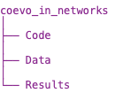
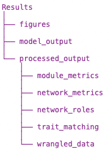

# About 

This document details the computer code used to generate data, analyze them and generate the plots found in `The joint role of coevolutionary selection and network structure in shaping trait complementarity in mutualisms`. This file consists of three parts. First, I describe the structure of the directories contained in `coevo_in_networks`. Second, I give a general description of what each file contained in the `Code` directory does. Third, I describe the sequence in which code should be run to replicate our findings. To ensure reproducibility, run code on `R` version 4.0.4 and `Julia` version 1.5.0 and reconstruct the directory structure as detailed below. A PDF version of this file is available [here](readme.pdf).

# Directory structure

The `coevo_in_networks` directory is structured as follows:  

__I.__ The `Code` subdirectory is structured as follows:

All subdirectories in `Code` have a self-explanatory name, nevertheless I briefly describe what each module does. 

* `build_networks`: This directory contains a script in the `Julia` language that generates the networks used to simulate coevolution.
* `coevolution_simulation`: This directory contains a script in the `R` language that simulates coevolution in a given network. 
* `data_wrangling`: This directory contains two `R` scripts that jointly clean-up data and build a unified database for further analyses.
* `measure_network_properties`: This directory contains seven `R` scripts. Together, they compute the structural properties of networks, modules and species.
* `plots`: This directory contains five `R` scripts. Each script generates a figure included in the main or supplemental text. 
* `process_results`: This directory contains two `R` scripts. One computes the degree of trait matching after coevolution, the other performs the Principal Component Analyses.

__II.__ The `Data` subdirectory is structured as follows:

* `for_modular`: This directory will house the networks generated by  
`build_networks.jl`, saved  in `.txt` format. The `MODULAR` [software](https://onlinelibrary.wiley.com/doi/full/10.1111/j.1600-0587.2013.00506.x) (used to compute modularity) should be run inside this directory!
* `networks`: This directory will store the networks generated by `build_networks.jl`, saved  in `.csv` format. These files will be used to measure the structural properties of the networks and to simulation coevolution.

__III.__ The `Results` subdirectory is structured as follows:

* `figures`: This directory will store the figures generated by the code contained in `Code/plots`
* `model_output`: This directory will store the results of simulating coevolution by running `HPC_run_simulations.jl`. It will contain a subdirectory for each level of mutualistic selection and these subdirectories will in turn, have a subdirectory for each network where coevolution was simulated. 
* `processed_output`: This directory contains five subdirectories where analyzed results are stored. These are:

  * `module_metrics`: Stores the output from `module_metrics.R`.
  * `network_metrics`: Stores the output from `run_compute_network_metrics.R`.
  * `network_roles`: Stores the output from `run_network_roles.R`.
  * `trait_matching`: Stores the output from `calculate_trait_matching.R`.
  * `wrangled_data`: Stores the output from `build_complete_data.R`.

# File description

In this section I traverse the `Code` subdirectories and give a short description of what each file does. For more detailed information on a particular file, refer to the comments provided inside the file. 

## `build_networks`

* `build_networks.jl`: This file employs the niche model to build a bipartite network with a pre-specified target connectance. At the moment, it is configured to build networks of size 60, although the size and ratio of consumer-resource species can be modified. The target connectance is set to range from 0.05 to 0.49 with increments of 0.02. For each particular value of connectance, the script will build 20 replica networks. Thus, this script will generate 460 different networks. A copy of each network is stored in `Data/networks` and `Data/for_modular/`. Networks will be stored as `.csv` in `networks` and as `.txt` in `for_modular`. Note that this script is meant to be run in parallel. 

## `coevolution_simulation`

* `HPC_run_simulations.jl`: This file simulates coevolution in a given bipartite network. It is currently configured to simulate coevolution in all the networks generated by `build_networks.jl` under varying degrees of mutualistic selection ranging from 0.1 to 0.95 with increments of 0.05. The script will perform 20 replica simulations for each network at each level of mutualistic selection. The output of a simulation is a `.csv` file containing the initial and final trait values of all species in the network. This file will be stored in `Results/model_output/`, in a subdirectory corresponding to the level of mutualistic selection and network file. This script will generate a total of 165,600 files. Note that this script is meant to be run in parallel. 

## `data_wrangling`

* `build_complete_data.R`: This file joins `merged_results.csv`,  `network_roles_niche.csv`, `modular_nested_metrics.csv` and  
`module_metrics.csv` into a single database named `complete_data.csv`. The script stores this output file inside the following directories  `Results/processed_output/wrangled_data/`. This structure should be pre-initialized.

* `merge_dataframes.R`: This file joins all result files containing the degree of trait matching at a particular level of mutualistic selection into a single database called `merged_results.csv`.  The script stores this output file inside `Results/processed_output/trait_matching/`. 

## `measure_network_properties`

* `compute_network_metrics_functions.R`: This script will compute the connectance, modularity, number of modules and nestedness of each network generated by `build_networks.jl`. Note that modularity is determined by the `MODULAR` [software](https://onlinelibrary.wiley.com/doi/full/10.1111/j.1600-0587.2013.00506.x). Please [download](http://sourceforge.net/projects/programmodular) the software and run it using the networks stored in the `for_modular` directory BEFORE running this script. This file will write results out to a file called `modular_nested_metrics.csv` located in  `Results/processed_output/network_metrics/`.

* `membership_function`: This script contains a function that groups species in a network by their module. It does not output a file but is used when processing data. 

* `module_metrics.R`: This script computes the connectance and size of each module for each network generated by `build_network.jl`. The results of the calculation are written to a file called `module_metrics.csv`. The script stores this output file inside `Results/processed_output/module_metrics/`. 

* `nestedness_function.R`: This script contains three functions. One measures the degree of nestedness in a network (following Bastolla et al. 2009), another records the connectance of a network, and the last one determines the role species play in a network. None of the functions output a file but all are used when processing data. 

* `network_roles_function.R`: This script contains a function that calculates the within-module degree and among-module connectivity for each species in the networks built by `build_network.jl`. It uses these two metrics to classify species by role. This function does not output a file but is used when processing data.

* `run_compute_network_metrics.R`: This script calls and passes the relevant parameters to the functions contained in `compute_network_metrics_functions.R`. Running this script will thus measure the structural properties of the networks. 

* `run_network_roles.R`: This script calls and passes the relevant parameters to the functions contained in `network_roles_function.R` and `membership_function.R`. Running this script will thus compute the role of each species in the networks. The result of these computations will be stored in a file called `network_roles_niche.csv` located in `Results/processed_output/network_roles/`.

## `plots`

* `figure_2.R`: This script will load in the data `complete_data_with_pca.csv` located in `Results/processed_output/wrangled_data/` and compute the correlation between structural properties and degree of trait matching after coevolution. The results will be plotted and saved to a file called `figure_2.pdf` located in `Results/figures/`.

* `figure_3.R`: This script will load in the data `complete_data_with_pca.csv` located in `Results/processed_output/wrangled_data/` and compute the redundancy analyses between structural properties and trait matching. The results will be plotted and saved to a file called `figure_3.pdf` located in `Results/figures/`.

* `figure_S1.R`: This script will load in the data `complete_data_with_pca.csv` located in `Results/processed_output/wrangled_data/` and plot the histogram of all structural descriptors. The output will be saved to a file called `figure_S1.pdf` located in `Results/figures/`.

* `figure_S2.R`: This script will load in the data `complete_data_with_pca.csv` located in `Results/processed_output/wrangled_data/` and compute the relevant Principal Component Analyses. It will then plot the coordinates of each structural descriptor along the principal components. Note that this script will require saving the plots and joining them into a single figure 'by hand'.

* `figures_S3_S4_and_S5.R`: This script will load in the data `complete_data_with_pca.csv` located in `Results/processed_output/wrangled_data/` and plot the relation between the degree of trait matching after coevolution and the structural properties of networks, modules or species. The output will be saved to three different files, each corresponding to the relevant scale. 

## `process_results`

* `calculate_trait_matching.R`: This script will load in the trait data generated by `HPC_run_simulations.jl` and will measure the degree of trait matching between species at the level of networks, modules and species. The script will do these tasks in parallel for each level of mutualistic selection. It will write the results to a file called `m_r_sq_trait_matching_analysis_niche_no_noise.csv` (where m is the relevant mutualistic selection value) located in  
`Results/processed_output/trait_matching/`.

* `run_PCAs`: This script will load in the data `complete_data.csv` located in  
`Results/processed_output/wrangled_data/` and perform the Principal Component Analyses at the level of networks, modules and species. It will append this data to the data frame and save it as a new file called `complete_data_with_pca.csv` located in `Results/processed_output/wrangled_data/`.

# Code sequence

In order to replicate the findings reported in `The joint role of coevolutionary selection and network structure in shaping trait complementarity in mutualisms`, you should run the provided code in the following sequence:  

    I. Build networks:
  
        a. Run build_networks.jl
    
    II. Measure network properties:
  
        a. Run MODULAR software
        b. Run run_compute_network_metrics.R
        c. Run module_metrics.R
        d. Run network_roles_function.R
    
    III. Simulate coevolution:  
  
        a. Run HPC_run_simulations.jl
    
    IV. Process the coevolution results:
    
        a. Run calculate_trait_matching.R
    
    V. Wrangle Data I
    
        a. Run build_complete_data.R
    
    VI. Perform PCAs
    
        a. Run run_PCAs.R
        
    VII. Wrangle Data II
    
        a. Run merge_dataframes.R
        
    VIII. Analyze and plot results
    
        a. Run figure_2.R
        b. Run figure_3.R

Note that running the entire workflow will likely take a couple of days as both
`build_networks.jl` and `HPC_run_simulations.jl` are slow scripts. The time can be reduced if the number of replicas or networks generated is decreased. Code should be run on `R` version 4.0.4 and `Julia` version 1.5.0.
  
